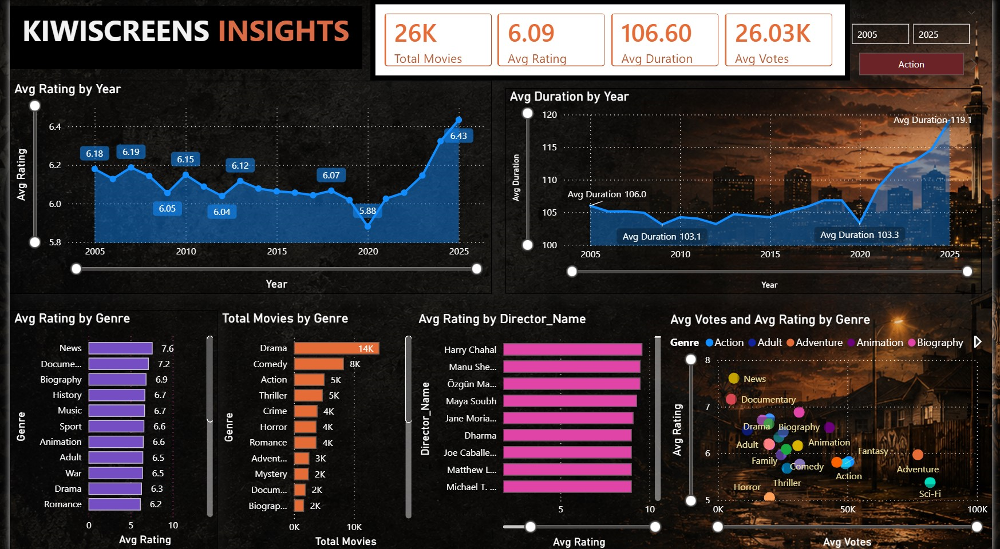

# Kiwi Insights Power BI Dashboard

A cinematic New Zealand-inspired Power BI dashboard focused on movie analytics, KPI visualization, and modern dashboard storytelling.
---
## Project Overview
This project demonstrates:
- Interactive Power BI dashboard design
- Dark cinematic UI inspired by Kiwi aesthetics
- KPI visualization and trend analysis
- Data storytelling techniques
---
## Features
- Interactive slicers and filters
- KPI cards
- Trend analysis charts
- Custom cinematic dashboard background
- Transparent visual design
---
## Tools Used
- Power BI
- DAX
- Power Query
- GitHub
---
## Files Included
| File | Description |
|---|---|
| KiwiInsights.pbix | Main Power BI dashboard |
| dashboard-preview.png | Dashboard screenshot |
| dashboard-preview.pdf | PDF export version |
---
## Dashboard Preview

---
## Author
Moe Thu Aung
MBA | CA Qualified | Power BI & FP&A Enthusiast
